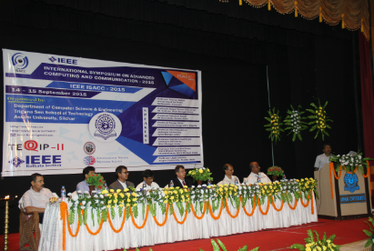
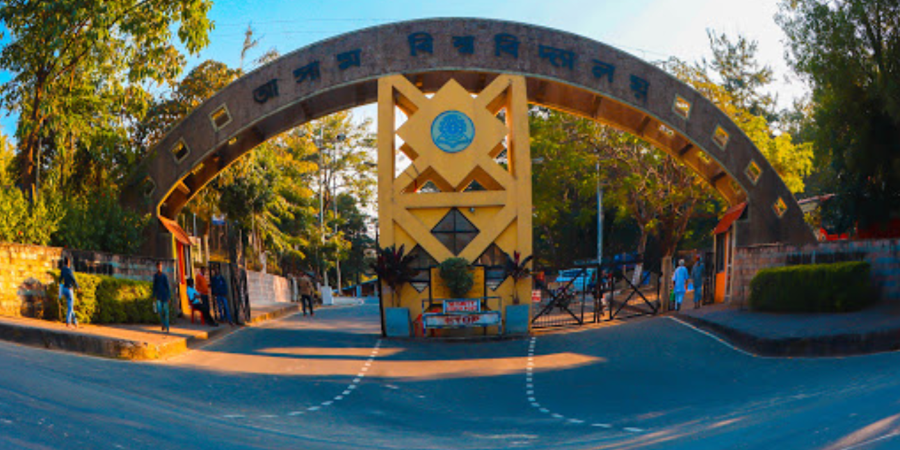
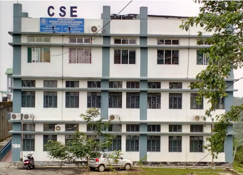

<!DOCTYPE html> 
<html lang="en">
<head>
    <meta charset="UTF-8">
    <meta name="viewport" content="width=device-width, initial-scale=1.0">
    <title>About ISACC</title>
    <link rel="stylesheet" href="../assets/css/style.css">
    
</head>
<body>

    
    <!-- Header Section -->
     <!-- Header Section -->
      <!-- Header Section -->

      <header>
        

            <!-- Logo Section -->
            

                
                
            

    
            <!-- Navigation Section -->
            <nav class="main-nav">
                <ul>
                    <li><a href="../index.html">Home</a></li>
                    <li><a href="./about.html">About</a></li>
                    <li><a href="./speakers.html">Speakers</a></li>
                    <li class="dropdown">
                        <a href="#" class="dropbtn">ISACC 2025</a>
                        

                            <a href="./commitees.html">Committees</a>
                            <a href="./tracks.html">Tracks</a>
                            <a href="./pages/submission.html">Submission</a>
                            <a href="./registration.html">Registration and Fees</a>
                            <a href="./author.html">Author Notification</a>
                            <a href="./dates.html">Important Dates</a>
                            <a href="./gallery.html">Gallery</a>
                        

                    </li>
                    <li><a href="./schedule.html">Schedule</a></li>
                    <li><a href="./sponsors.html">Technical Sponsors</a></li>
                    <li class="dropdown">
                        <a href="#" class="dropbtn">Past Conferences</a>
                        

                            <a href="https://ieeexplore.ieee.org/xpl/conhome/10083315/proceeding">ISACC 2023</a>
                            <a href="https://ieeexplore.ieee.org/xpl/conhome/7368273/proceeding">ISACC 2015</a>
                        

                    </li>
                    <li><a href="./venue.html">Venue and Contact</a></li>
                </ul>
            </nav>
            
            <!-- Mobile Menu Toggle -->
            
☰

        

    </header>
    
    
    

    <section id="about-details-section" class="about-details-section">
        

            

                

                    

                        
                    

                    

                        <h2>About ISACC 2025</h2>
                        <!-- 
The objective of ISACC 2025 is to support the development of new computational and cognitive paradigms stemming from the cross-fertilization of various research fields. Theoretical and/or application-oriented papers are invited concerning all types of learning, knowledge discovery, evolutionary mechanisms, human cognition and learning, and emergent systems that can lead to key technologies to a broader audience group. ISACC 2025 will serve as a platform in the field of computation and AI that will enable academic, research community, and practitioners to collaborate, network, exchange and disseminate the knowledge.
 -->
                        
The primary aim of ISACC 2025 is to foster the growth and advancement of novel computational and cognitive frameworks that emerge from the intersection of various interdisciplinary research domains. The conference invites submissions of both theoretical and application-oriented papers that delve into diverse areas such as all forms of learning, knowledge discovery, evolutionary processes, human cognition, and emergent systems. These areas of research are expected to contribute significantly to the development of cutting-edge technologies, reaching a wide spectrum of interested stakeholders. ISACC 2025 aspires to become a pivotal forum in the realm of computation and artificial intelligence (AI), facilitating collaboration, networking, and the exchange of knowledge among academicians, researchers, and practitioners. This platform will be instrumental in uniting different segments of the scientific community, thereby driving innovation and the dissemination of valuable insights in these rapidly evolving fields.

                    
                    

                

            

    
            

                

                    

                        
                    

                    

                        <h2>About Assam University</h2>
                        <!-- 
Assam University, Silchar came into existence in 1994 after the enactment of the Assam (Central) University Act 1989. Through its pursuit, Assam University is in the process of making itself an institute of excellence. Assam University's main campus is situated at Dargakona, about 20 km away from Silchar. The campus is set amid sprawling hillocks and the typical landscape of the northeast. The campus is spread over 600 acres and provides an ideal environment for the researchers, students, and people interested in academic excellence.
 -->
                        
Assam University, Silchar, was established in 1994 following the enactment of the Assam (Central) University Act of 1989. The university has been striving to establish itself as a center of excellence in higher education and research. The main campus is located at Dargakona, approximately 20 kilometers from Silchar, in a region characterized by the scenic hillocks and lush landscape typical of northeastern India. Spanning over 600 acres, the campus provides an ideal environment for academic pursuits, offering a serene and stimulating setting for researchers, students, and anyone committed to achieving academic excellence. Through its continuous efforts, Assam University is dedicated to becoming a distinguished institution recognized for its academic and research contributions.
 
                    

                

            

    
            

                

                    

                        
                    

                    

                        <h3>About Department of Computer Science & Engineering</h3>
                        <!-- 
The Department of Computer Science and Engineering (formerly Department of Information Technology) under Triguna Sen School of Technology (TSSOT), was established in 2006. It offers Bachelor, Master and Doctoral degree programs in Computer Science and Engineering.These programs are designed to equip students with strong foundational knowledge, advanced technical skills, and research capabilities in various areas of computer science and engineering, preparing them for careers in academia, industry, and research.
 -->
                        
The department offers a comprehensive range of academic programs, including Bachelor's, Master's, and Doctoral degrees in Computer Science and Engineering. These programs are meticulously designed to provide students with a robust foundation in core principles, alongside advanced technical skills and research capabilities. Students are exposed to various facets of computer science, preparing them for successful careers in academia, industry, and research. Through these programs, the department aims to cultivate the next generation of computer science professionals who are well-equipped to contribute to technological innovation and address complex challenges in the ever-evolving tech landscape.
 
                    

                

            

        

    </section>
    

<!-- FOOTER -->

<footer>
    

        

            
&copy; 2024 Assam University, India | All Rights Reserved

            
Department of Computer Science & Engineering, Assam University

        

        

            <!-- Back to Top Button -->
            <a href="#top" class="back-to-top">Back to Top</a>
            <!-- Visitor Counter -->
            

                <a href="https://www.free-counters.org/">Get free Counters</a>
                
                
            

        

        

            <h3>Location</h3>
            <iframe src="https://www.google.com/maps/embed?pb=!1m14!1m8!1m3!1d14501.563105449173!2d92.75134!3d24.67909!3m2!1i1024!2i768!4f13.1!3m3!1m2!1s0x374e3824e8e868b9%3A0x78c2682ac4badc2b!2sDepartment%20of%20Computer%20Science%20%26%20Engineering%2C%20Assam%20University!5e0!3m2!1sen!2sin!4v1725109964004!5m2!1sen!2sin" width="250" height="200" style="border:0;" allowfullscreen="" loading="lazy" referrerpolicy="no-referrer-when-downgrade"></iframe>
        

    

</footer>

<!-- script custom -->

<!-- script custom END -->

</body>
</html>

